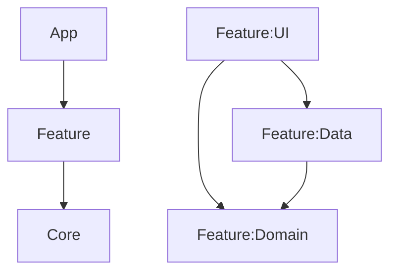

# Project Architecture & Structure

This project follows a modular, clean-architecture approach optimized for scalability, testability, and clear separation of concerns.

## Overview

The project is divided into three main layers: **App**, **Features**, and **Core**.

---

## 1. App Module (`:app`)
The "Glue" module. It is the entry point of the application.
- **Responsibilities**: Application class, Hilt entry point, global Navigation Host (`AppNavGraph`), and dependency aggregation.
- **Dependencies**: Depends on all `:feature:*:ui` and `:feature:*:data` modules to assemble the app.

---

## 2. Feature Modules (`:feature`)
Each feature is located in the `feature/` directory and is strictly divided into three sub-modules to enforce clean architecture boundaries.

### `:feature:<name>:domain`
- **Purpose**: Pure business logic and models.
- **Contents**: Domain Models, Repository Interfaces, Use Cases.
- **Dependencies**: `:core:common`, `:core:domain`. No dependencies on UI or Data.

### `:feature:<name>:data`
- **Purpose**: Data sourcing and persistence implementation.
- **Contents**: Repository Implementations, Room Entities, Room DAOs, Data Sources (Local/Remote).
- **Dependencies**: `:feature:<name>:domain`, `:core:database`, `:core:datastore`, `:core:network`.

### `:feature:<name>:ui`
- **Purpose**: Presentation layer.
- **Contents**: Compose Screens, ViewModels, UI State, Navigation Routes.
- **Dependencies**: `:feature:<name>:domain`, `:feature:<name>:data`, `:core:ui`, `:core:navigation`.

---

## 3. Core Modules (`:core`)
Shared infrastructure used by multiple features.

| Module | Responsibility |
| :--- | :--- |
| `:core:common` | Shared utilities, `AppResult` types, and global constants. |
| `:core:database` | The Room `AppDatabase` aggregator and global entities. |
| `:core:domain` | Base classes for UseCases (`FlowUseCase`, etc.). |
| `:core:ui` | Design system, reusable Compose components, and themes. |
| `:core:navigation` | Type-safe navigation routes and shared navigation logic. |
| `:core:network` | Retrofit configuration, OkHttp interceptors, and network monitoring. |
| `:core:datastore` | User preferences and persistent settings via DataStore. |
| `:core:sync` | Background synchronization logic using WorkManager. |
| `:core:lint` | Custom lint rules and static analysis configuration. |

---

## Key Architecture Patterns

### Database Aggregation
We use an **Aggregator Pattern** for Room. 
- **Entities & DAOs**: Feature-specific entities (like `TodoEntity`) live in the `:feature:<name>:data` module.
- **Database Class**: The `AppDatabase` lives in `:core:database`. It imports the entities from the feature modules to build the final database implementation.
- **DAOs**: Provided via Hilt from `:core:database` to the rest of the app.

### Dependency Injection
Powered by **Hilt**.
- Convention plugins are used to apply Hilt consistently across modules.
- Each `:feature:<name>:data` module contains a `DataModule` for binding implementations to interfaces.

---

## Tooling & Scripts

- `create_feature.sh`: Scaffolds a new feature with the 3-module (ui, data, domain) structure, including boilerplate for Repository, ViewModel, and Navigation.
- `init_project.sh`: Initializes a new project from this template, performing global package renaming and module adjustment.

## Build Logic (`:build-logic`)
Contains **Gradle Convention Plugins**. Instead of repeating build logic in every `build.gradle.kts`, we apply custom plugins like:
- `androidtemplate.android.library`
- `androidtemplate.android.feature`
- `androidtemplate.android.hilt`
- `androidtemplate.android.room`
