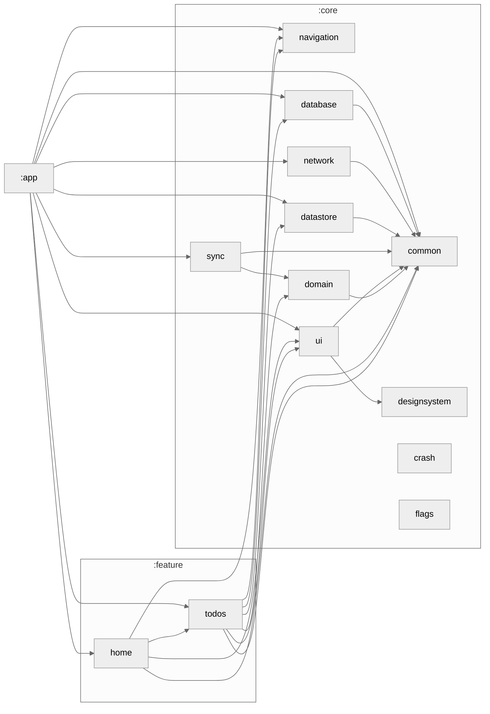

# Android Template Project

[](https://kotlinlang.org)
[](https://gradle.org)
[](https://developer.android.com/studio/releases/gradle-plugin)
[](https://developer.android.com/jetpack/compose)
[](LICENSE)

A **production-ready Android template** showcasing modern Android development with multi-module clean architecture, Jetpack Compose, and comprehensive tooling. Use it as a starting point for scalable, testable, and maintainable Android applications.

---

## ✨ Highlights

| Category | Features |
|----------|----------|
| **Architecture** | Multi-module clean architecture · Convention plugins · Dependency graph enforcement |
| **UI** | Jetpack Compose · Material 3 · Dynamic colors · Two-tier design system · Adaptive layouts |
| **Navigation** | Type-safe routes via kotlinx.serialization · Nested navigation graphs |
| **Networking** | Retrofit 3 · OkHttp 5 · Custom `AppResult` call adapter · 401 session management |
| **Persistence** | Room (aggregator pattern) · DataStore preferences |
| **DI** | Hilt across all layers · WorkManager integration |
| **Background** | WorkManager-based sync abstraction · Periodic & one-time work |
| **Quality** | Ktlint · Detekt · Custom Lint rules · Module graph assertion · Dependency analysis |
| **Testing** | JUnit · Turbine · MockK · Roborazzi screenshot tests · Macrobenchmarks |
| **CI/CD** | GitHub Actions · Fastlane · Dependabot · SARIF reports |
| **Extras** | Crash reporter abstraction · Feature flags framework · Baseline profiles |

---

## 🏗️ Architecture

```
app/                           → Entry point, DI aggregation, Room database, NavHost
├── core/
│   ├── common/                → AppResult, NetworkMonitor, Dispatcher qualifiers
│   ├── domain/                → Base use cases (UseCase, FlowUseCase)
│   ├── network/               → Retrofit, OkHttp, ApiResultCallAdapter, SessionManager
│   ├── database/              → BaseDao, Room contracts
│   ├── datastore/             → DataStore UserPreferences
│   ├── designsystem/          → Theme, Colors, Spacing, AppButton, AppImage
│   ├── ui/                    → LoadingScreen, ErrorScreen, EmptyScreen, NetworkBanner
│   ├── navigation/            → Type-safe Route definitions, NavHost
│   ├── sync/                  → WorkManager abstraction (SyncManager, SyncWorker)
│   ├── crash/                 → CrashReporter interface + Timber impl
│   └── flags/                 → Feature flag framework
├── feature/
│   ├── home/                  → Splash, Main shell with bottom nav
│   └── todos/                 → Full domain/data/ui reference implementation
│       ├── domain/            → Models, repository interfaces, use cases
│       ├── data/              → Room entities, DAOs, repository impl
│       └── ui/                → Screens, ViewModels, navigation graph
├── lint/                      → Custom lint rules (DirectColor, ViewModel naming)
├── baselineprofile/           → Startup benchmarks & profile generation
└── build-logic/               → Gradle convention plugins
```

> **Full architecture documentation:** [docs/architecture/overview.md](docs/architecture/overview.md)

---

## 🚀 Quick Start

```bash
# Clone
git clone <your-repo-url> && cd androidtemplate

# (Optional) Initialize as a new project with custom package name
./init_project.sh

# Build
./gradlew assembleDebug

# Run quality checks
./gradlew ktlintFormat && ./gradlew ktlintCheck detektAll test lintDebug
```

> **Detailed setup guide:** [docs/guides/getting-started.md](docs/guides/getting-started.md)

---

## 🛠️ Tech Stack

| Layer | Libraries |
|-------|-----------|
| **Language** | Kotlin 2.3.0 · Coroutines 1.11.0 · kotlinx.serialization 1.11.0 |
| **UI** | Jetpack Compose (BOM 2026.05.01) · Material 3 · Coil 2.7.0 |
| **DI** | Hilt 2.59.2 · KSP 2.3.9 |
| **Network** | Retrofit 3.0.0 · OkHttp 5.4.0 |
| **Storage** | Room 2.8.4 · DataStore 1.2.1 |
| **Navigation** | Navigation Compose 2.9.8 · Navigation 3 1.1.2 |
| **Background** | WorkManager 2.11.2 |
| **Testing** | JUnit 4.13.2 · Turbine 1.2.1 · MockK 1.14.11 · Roborazzi 1.64.0 · Macrobenchmark |
| **Quality** | Ktlint 14.2.0 · Detekt 1.23.8 · Custom Lint rules |
| **CI/CD** | GitHub Actions · Fastlane · Dependabot |

---

## 📐 Key Patterns

### AppResult — Unified Error Handling
```kotlin
sealed interface AppResult<out T> {
    data class Success<T>(val data: T) : AppResult<T>
    data class Error(val exception: AppError) : AppResult<Nothing>
    data object Loading : AppResult<Nothing>
}
```

### Type-Safe Navigation
```kotlin
@Serializable sealed interface Route {
    @Serializable data object Home : Route
    @Serializable data class TodoDetails(val todoId: String) : Route
}
navController.navigate(Route.TodoDetails(todoId = "abc"))
```

### Convention Plugins
```kotlin
// One line replaces 30+ lines of build config
plugins { id("androidtemplate.android.feature") }
```

> **All patterns explained:** [docs/architecture/patterns.md](docs/architecture/patterns.md)

---

## 🎯 Build Commands

| Task | Command |
|------|---------|
| Debug APK | `./gradlew assembleDebug` |
| Release AAB | `./gradlew bundleRelease` |
| Unit tests | `./gradlew test` |
| Format code | `./gradlew ktlintFormat` |
| Static analysis | `./gradlew detektAll` |
| Architecture check | `./gradlew assertModuleGraph` |
| Dependency health | `./gradlew buildHealth` |
| Full CI (Fastlane) | `bundle exec fastlane ci` |

---

## 🧰 Create a New Feature

```bash
./create_feature.sh my_feature
```

Scaffolds the full `domain/data/ui` module structure with boilerplate code, then register in `settings.gradle.kts`.

> **Feature module guide:** [docs/modules/feature-modules.md](docs/modules/feature-modules.md)

---

## 📚 Documentation

| Document | Description |
|----------|-------------|
| **Architecture** | |
| [Architecture Overview](docs/architecture/overview.md) | Layers, principles, and data flow |
| [Module Graph](docs/architecture/module-graph.md) | Visual dependency graph and enforcement rules |
| [Architecture Patterns](docs/architecture/patterns.md) | AppResult, UseCases, Repository, Aggregator patterns |
| **Modules** | |
| [Core Modules](docs/modules/core-modules.md) | All 11 core modules with APIs and dependencies |
| [Feature Modules](docs/modules/feature-modules.md) | Feature structure and the Todos reference implementation |
| [Build Logic](docs/modules/build-logic.md) | Convention plugins and how to extend them |
| **Guides** | |
| [Getting Started](docs/guides/getting-started.md) | Setup, prerequisites, and development workflow |
| [Design System](docs/guides/design-system.md) | Theme, tokens, components, and adaptive layouts |
| [Navigation](docs/guides/navigation.md) | Type-safe routing and nested navigation |
| [Dependency Injection](docs/guides/dependency-injection.md) | Hilt setup across all layers |
| [Networking](docs/guides/networking.md) | Retrofit, call adapter, session management |
| [Data Persistence](docs/guides/data-persistence.md) | Room aggregator pattern and DataStore |
| [Background Sync](docs/guides/background-sync.md) | WorkManager abstraction |
| [Testing](docs/guides/testing.md) | Unit, screenshot, and performance testing |
| [Localization & RTL](docs/localization.md) | Language switching and RTL support |
| **Tooling** | |
| [Code Quality](docs/tooling/code-quality.md) | Ktlint, Detekt, custom lint, dependency analysis |
| [CI/CD & Automation](docs/tooling/ci-cd.md) | GitHub Actions, Fastlane, Dependabot, scripts |
| **ADRs** | |
| [ADR Template](docs/adr/template.md) | Template for new architecture decisions |
| [ADR-0001](docs/adr/0001-record-architecture-decisions.md) | Record architecture decisions |

---

## Module Graph



---

## 🤝 Contributing

1. Fork the repository
2. Create a feature branch (`git checkout -b feature/amazing-feature`)
3. Run quality checks (`bundle exec fastlane quality`)
4. Commit your changes
5. Open a Pull Request

## 📄 License

This project is licensed under the MIT License — see the [LICENSE](LICENSE) file for details.

---

**Made with ❤️ and Kotlin**
