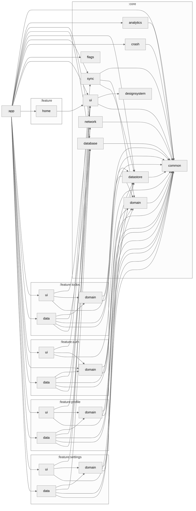

# AndroidTemplate

A plug & play, multi-module Android starter: Jetpack Compose, Hilt, Room, type-safe Navigation
(kotlinx.serialization routes), Retrofit/OkHttp, DataStore and WorkManager, with convention plugins,
architecture rules, static analysis, screenshot tests and CI already wired up. It ships with sample
features (`todos`, `auth`, `profile`, `settings`, `home`) that show the intended layering.

## Quick start

Requirements: JDK 21 (Gradle provisions it for the daemon via `gradle/gradle-daemon-jvm.properties`) and the Android SDK.

<!-- template-only: init_project.sh removes this block from generated projects -->
Create a new project from the template (run from this repo; the target must be outside it):

```bash
./scripts/init_project.sh com.example.myapp tasks MyApp ~/AndroidProjects/MyApp
```

This copies the template, renames the `com.aragabz.androidtemplate` package, the `todos` sample feature
(`Todo*` classes become `Task*`) and the `AndroidTemplate` project name. An optional fifth argument sets
the singular feature name when stripping a trailing `s` is wrong.

<!-- /template-only -->
Add a feature (from the project root):

```bash
./scripts/create_feature.sh Tasks
```

It scaffolds `feature/tasks/{domain,data,ui}` (the domain module is pure Kotlin/JVM), registers the modules
in `settings.gradle.kts` and prints the remaining manual wiring (database entity/DAO, `:app` dependencies,
navigation graph).

## Common commands

```bash
./gradlew :app:assembleDevDebug          # :app has dev/staging/prod flavors
./gradlew assertModuleGraph ktlintCheck detekt :app:lintDevDebug
./gradlew testDebugUnitTest :app:testDevDebugUnitTest :lint:test
./gradlew :app:verifyDebugCoverage       # COVERAGE_MIN_LINE in gradle.properties
./gradlew :core:ui:verifyRoborazziDebug  # screenshot tests (recordRoborazziDebug to update)
./gradlew :app:assembleProdRelease       # R8; signed only when RELEASE_* properties are set
./gradlew buildHealth                    # dependency-analysis report
./gradlew createModuleGraph              # regenerates the graph below
```

`CLAUDE.md` documents the full CI sequence, the module layers and dependency rules, the database setup
and the Gradle properties (`VERSION_CODE`, `VERSION_NAME`, `COVERAGE_MIN_LINE`, `composeCompilerReports`,
release signing). `build-logic/README.md` describes the convention plugins.

## Module Graph

