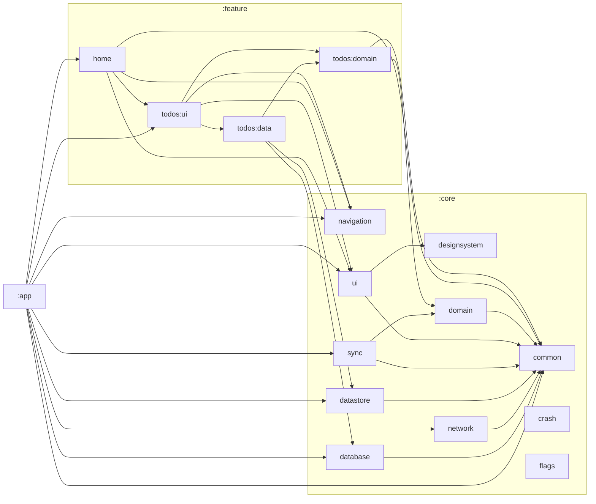

# Module Dependency Graph

## Visual Graph



## Dependency Rules

Enforced via `module-graph-assertion` plugin in the root `build.gradle.kts`:

```kotlin
moduleGraphAssert {
    allowed = arrayOf(
        ":feature:.* -> :core:.*",    // Features can depend on core
        ":app -> :feature:.*",         // App can depend on features
        ":app -> :core:.*",            // App can depend on core
        ":core:.* -> :core:.*"         // Core modules can depend on each other
    )
    maxHeight = 4  // Maximum dependency chain depth
}
```

## Regenerating the Graph

```bash
./gradlew createModuleGraph
```

This updates the module graph in the README automatically.

## Validating the Graph

```bash
./gradlew assertModuleGraph
```

Run this in CI to prevent architecture violations.
