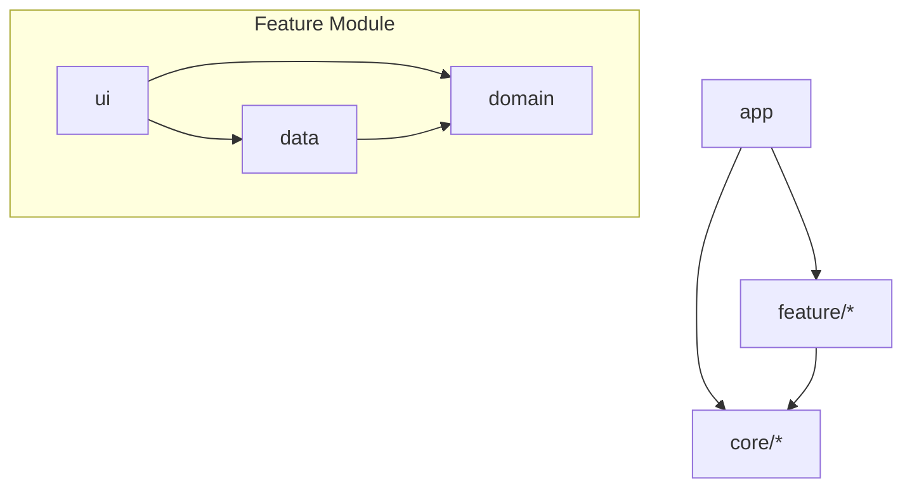

# Architecture Overview

This project follows a **modular clean architecture** approach optimized for scalability, testability, and clear separation of concerns.

## Layers



## Principles

1. **Unidirectional Data Flow** — UI observes state from ViewModels, which delegate to use cases and repositories.
2. **Dependency Rule** — Inner layers (domain) never depend on outer layers (data/ui). Dependencies point inward.
3. **Single Responsibility** — Each module has a clearly defined scope. Features are self-contained.
4. **Interface Segregation** — Repositories expose interfaces in `:domain`; implementations live in `:data`.

## Module Categories

| Category | Modules | Role |
|----------|---------|------|
| **App** | `:app` | Entry point, DI aggregation, navigation host, Room database |
| **Feature** | `:feature:<name>:domain`, `data`, `ui` | Self-contained business features |
| **Core** | `:core:common`, `network`, `database`, `datastore`, `designsystem`, `ui`, `navigation`, `domain`, `sync`, `crash`, `flags` | Shared infrastructure |
| **Tooling** | `:lint`, `:baselineprofile` | Code quality and performance |

## Key Design Decisions

- **Room Database** lives in `:app` to aggregate entities from all feature modules (Aggregator Pattern).
- **Navigation** uses type-safe serializable routes defined in `:core:navigation`.
- **AppResult** wraps all async operations for consistent error handling across layers.
- **Convention Plugins** in `build-logic/` standardize Gradle configuration for all modules.

## Data Flow Example

```
User Action → Composable → ViewModel → UseCase → Repository → DataSource (Network/Room/DataStore)
                ↑                                                    |
                └────────────── Flow<AppResult<T>> ─────────────────┘
```

## Architecture Governance

- `./gradlew assertModuleGraph` enforces dependency rules (features cannot depend on other features).
- `./gradlew buildHealth` detects unused or misplaced dependencies.
- Custom lint rules enforce ViewModel naming and design system usage.
